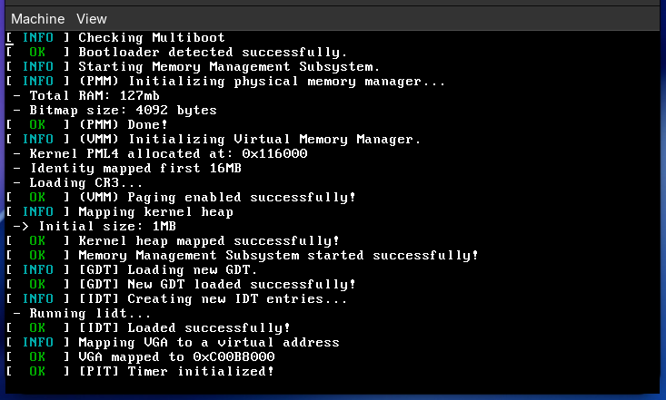

# 🦎 My Own Kernel (Zig Edition)


Um kernel experimental escrito do zero, focando em modernidade e segurança de memória. Inicialmente concebido em C, o projeto foi **migrado para Zig** para explorar recursos de linguagem moderna em desenvolvimento de baixo nível (OSDev).

O objetivo é construir um pequeno sistema operacional x86_64 compatível com Multiboot, implementando gerenciamento de memória, interrupções e drivers básicos.

---

## 📸 Screenshots

> *Estado atual do kernel executando no QEMU, exibindo a inicialização do Memory Management Subsystem.*



---

## 🚀 Status do Projeto

O kernel está na fase de **Gerenciamento das Interrupções de Hardware**. A base de código já foi refatorada e escrita em Zig.

### ✅ Implementado
- [x] **Bootloader:** Suporte a Multiboot (GRUB) via Assembly (`multiboot_header.asm`).
- [x] **Kernel Entry:** Ponto de entrada migrado para Zig (`kernel/main.zig`).
- [x] **Driver VGA:** Implementação completa em Zig com suporte a cores e strings (`kernel/vga.zig`).
- [x] **IDT (Interrupt Descriptor Table):** Tratamento básico de interrupções e exceções implementado em Zig.
- [x] **Multiboot Parsing:** Leitura do mapa de memória fornecido pelo BIOS/GRUB.
- [x] **PMM (Physical Memory Manager):**
  - Alocador de páginas físicas (4KB).
  - Uso de **Bitmap** para rastrear memória livre/ocupada.
  - Proteção de memória do Kernel e do próprio Bitmap.
- [x] **VMM (Virtual Memory Manager):** Paginação e mapeamento de memória virtual.
- [x] **Heap Allocator:** Implementação de `kmalloc` e `kfree`.
- [x] **GDT (Global Descriptor Table):** Refinamento da GDT em Zig.

### 🚧 Em Progresso / Próximos Passos

- [ ] **Keyboard Driver:** Driver PS/2 básico para entrada de dados.

---

## 🛠️ Como Compilar e Executar

### Dependências
Para compilar este projeto, você precisará das seguintes ferramentas instaladas no seu Linux (Manjaro/Arch ou similar):

* **Zig** (Compilador principal)
* **NASM** (Assembler para os stubs de boot)
* **QEMU** (Emulador para testes)
* **GRUB / xorriso** (Para criar a imagem ISO bootável)
* **Linker (`ld`)** (Geralmente parte do binutils)

### Comandos (Makefile)

O projeto utiliza um `Makefile` para facilitar o fluxo de desenvolvimento:

```bash
# Compilar todo o kernel e gerar a ISO
make all

# Compilar e executar imediatamente no QEMU
make run

# Limpar arquivos de build (.o, .elf, .iso)
make clean

# Executar em modo Debug (aguarda conexão do GDB)
make debug

```

---

## 📂 Estrutura do Projeto

```text
/
├── kernel/
│   ├── arch/x86/        # Código específico de arquitetura (Assembly/Boot/x86)
│   ├── mm/              # Gerenciamento de Memória (Heap, VMM, PMM, Bitmap)
│   ├── cpu.zig          # Utilitários do processador
│   ├── idt.zig          # Tabela de Interrupções
│   ├── gdt.zig          # Tabela de Descrição Global
│   ├── main.zig         # Ponto de entrada do Kernel
│   ├── vga.zig          # Driver de Vídeo (Texto)
│   └── multiboot.zig    # Parsing do cabeçalho Multiboot
├── linker.ld            # Script de Linkagem
└── Makefile             # Automação de build

```

---

## 🧠 Aprendizados

Este projeto é um estudo prático sobre:

1. **Interoperabilidade Zig/C/Assembly:** Como o Zig interage com código "naked" e convenções de chamada C.
2. **Hardware Real:** Manipulação direta de endereços de memória, VGA buffer e registradores da CPU.
3. **Algoritmos de OS:** Implementação manual de estruturas de dados como Bitmaps e Listas Encadeadas sem biblioteca padrão (`libc` ou `std`).