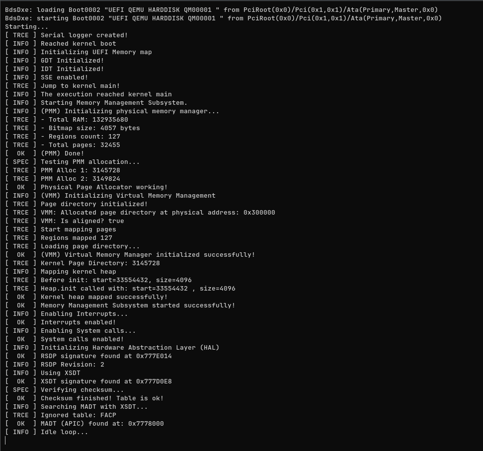

# 🦎 My Own Kernel (Zig Edition)


A hobby x86_64 kernel written from scratch in Zig. This is a personal, educational project — I'm building it to learn low-level systems programming, memory management, hardware interfacing, and operating system design using modern tooling.

Initially conceived in C, the project **migrated to Zig** to leverage modern language features in OS development.

---

## 📸 Screenshots

> *Current state of the kernel running in QEMU, booting via UEFI with the Memory Management Subsystem initializing.*



---

## 🚀 Project Status

The kernel boots **natively via UEFI** — no GRUB/Multiboot legacy path. The `make run-uefi` target is the primary way to run it.

I am currently implementing a **Hardware Abstraction Layer (HAL)** to map modern hardware using the **APIC** (Advanced Programmable Interrupt Controller) instead of the legacy PIC. ACPI tables (RSDP → XSDT → MADT) are already being parsed to discover the APIC base address.

### ✅ Implemented
- [x] **UEFI Bootloader:** Hand-written Zig UEFI app loads `kernel.bin` and passes a `BootInfo` struct (memory map, RSDP address).
- [x] **Physical Memory Manager:** 4KB page bitmap allocator with kernel/bitmap memory protection.
- [x] **Virtual Memory Manager:** Higher-half 4-level paging (offset `0xFFFF800000000000`).
- [x] **Heap Allocator:** Linked-list `kmalloc`/`kfree` with block magic (`0xc0ffee`).
- [x] **GDT:** Kernel code/data, user code/data, TSS.
- [x] **IDT:** Full 256-entry table generated at compile time from assembly stubs.
- [x] **PIC (legacy):** IRQ remapping (master 0x20, slave 0xA0).
- [x] **PIT Timer:** Programmable Interval Timer at 100 Hz.
- [x] **PS/2 Keyboard Driver:** Interrupt-driven input.
- [x] **VGA Text Mode Driver:** Colored console output (via 0xB8000 mapped at 0xC00B8000).
- [x] **Syscall Infrastructure:** `swapgs`/`sysretq` entry, handlers for `exit`, `yield`, `sleep`.
- [x] **Scheduler:** Round-robin with circular linked-list of threads (no ready threads at boot).
- [x] **Process Model:** Parent/child/sibling tree, ref-counted, page directory cloning.

### 🚧 In Progress
- [ ] **Hardware Abstraction Layer (HAL):** ACPI (RSDP/XSDT/MADT) parsing, APIC discovery and initialization.
- [ ] **APIC:** Replacing the legacy PIC with the local APIC and I/O APIC for interrupt management.

---

## 🛠️ How to Build and Run

### Dependencies

| Tool | Purpose |
|------|---------|
| **Zig 0.16** | Primary compiler (managed via [zvm](https://github.com/tristanisham/zvm)) |
| **NASM** | Assembler for boot stubs |
| **QEMU** | Emulator for testing |
| **Linker (`ld`)** | Part of binutils for the legacy Multiboot path |
| **OVMF** | UEFI firmware (`/usr/share/edk2/x64/OVMF.4m.fd`) |
| **xorriso** | ISO creation (legacy Multiboot path only) |

> **Important:** The project uses Zig **0.16**. Install it with `zvm install 0.16.0 && zvm use 0.16.0`.

### Makefile Targets

The project has moved away from Multiboot/GRUB. The **`run-uefi`** target is the recommended way to run:

```bash
# Build and boot via UEFI (recommended)
make run-uefi

# Build Multiboot ISO and run via GRUB (legacy)
make run

# Debug mode (QEMU + GDB stub)
make debug

# Clean build artifacts
make clean

# List discovered Zig sources
make info
```

---

## 📂 Project Structure

```text
/
├── kernel/
│   ├── arch/x86/        # Architecture-specific code (GDT, IDT, paging, syscall ABI, boot)
│   │   ├── hal/         # Hardware Abstraction Layer (ACPI → APIC)
│   │   ├── interrupts/  # PIC, IDT stubs
│   │   ├── mem/         # Paging, memory layout
│   │   ├── cpu/         # CPU features (GDT, TSS, syscalls)
│   │   └── sys/         # Syscall entry/context
│   ├── boot/            # UEFI bootloader (start.zig) + BootInfo shared struct
│   ├── drivers/         # VGA, keyboard, timer
│   ├── hal/             # Interface definitions (e.g., InterruptController)
│   ├── mm/              # Memory management (PMM, VMM, heap)
│   ├── proc/            # Process manager
│   ├── sch/             # Scheduler + context switch
│   ├── sys/             # Syscall handlers
│   ├── utils/           # Logger, VGA, serial, libc stubs
│   └── lib/             # Generic library code (I/O, logging helpers)
├── build.zig            # Zig build system (cross-compilation, UEFI target)
├── kernel.ld            # Linker script (UEFI boot path)
├── linker.ld            # Linker script (legacy Multiboot path)
└── Makefile             # Build automation
```
