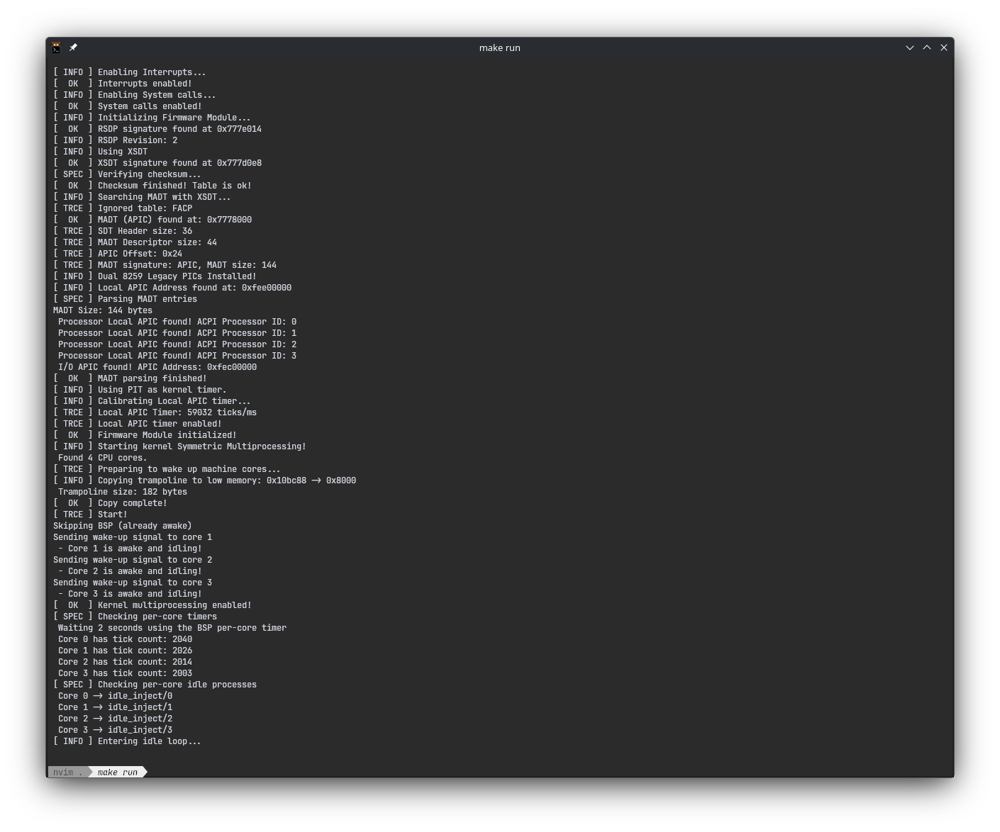

# My Own Kernel (Zig Edition)


A hobby x86_64 kernel written from scratch in Zig. This is a personal, educational project — I'm building it to learn low-level systems programming, memory management, hardware interfacing, and operating system design using modern tooling.

Initially conceived in C, the project **migrated to Zig** to leverage modern language features in OS development.

---

## Screenshots

> *Current state of the kernel running in QEMU, booting via UEFI with the serial output, printed in stdio*



---

## Project Status

The kernel boots **natively via UEFI**. The `make run` target is the primary way to run it.

### Implemented
- [x] **UEFI Bootloader:** Hand-written Zig UEFI app loads `kernel.bin` and passes a `BootInfo` struct.
- [x] **Physical Memory Manager:** 4KB page bitmap allocator with kernel/bitmap memory protection.
- [x] **Virtual Memory Manager:** Higher-half 4-level paging (offset `0xFFFF800000000000`).
- [x] **Heap Allocator:** Implementation of `std.mem.Allocator` with a Linked-List.
- [x] **GDT:** Kernel code/data, user code/data, TSS.
- [x] **IDT:** Full 256-entry table generated at compile time from assembly stubs.
- [x] **PIC (legacy):** IRQ remapping (master 0x20, slave 0xA0).
- [x] **PIT Timer:** Programmable Interval Timer at 1000 Hz.
- [x] **Syscall Infrastructure:** `swapgs`/`sysretq` entry, handlers for `exit`, `yield`, `sleep`.
- [x] **Hardware Abstraction Layer (HAL):** ACPI (RSDP/XSDT/MADT) parsing and initial APIC topology discovery.
- [x] **Symmetric Multiprocessing (SMP):** Send wake-up signals for each core.
### In Progress
- [ ] **APIC:** Replacing the legacy PIC with the local APIC and I/O APIC for interrupt management.
- [ ] **Multicore Scheduler:** Evolving the task scheduler to handle thread dispatching and context switching across multiple APs (Application Processors) now that SMP is initialized.

---

## How to Build and Run

### Dependencies

| Tool | Purpose |
|------|---------|
| **Zig 0.15** | Primary compiler (managed via [zvm](https://github.com/tristanisham/zvm)) |
| **QEMU** | Emulator for testing |
| **OVMF** | UEFI firmware (`/usr/share/edk2/x64/OVMF.4m.fd`) |

> **Important:** The project uses Zig **0.15**. Install it with `zvm install 0.15 && zvm use 0.15`.

### Makefile Targets

```bash
# Build and boot via UEFI (recommended)
make run

# Debug mode (QEMU + GDB stub)
make debug

# Clean build artifacts
make clean

# List discovered Zig sources
make info
```

---

## Project Structure

```text
/
├── kernel/
│   ├── arch/x86/        # Architecture-specific code (GDT, IDT, paging, syscall ABI, boot)
│   │   ├── firmware/    # Firmware core (ACPI)
│   │   ├── interrupts/  # PIC, APIC and IDT stubs
│   │   ├── mem/         # Paging, memory layout
│   │   ├── cpu/         # CPU features (GDT, TSS, syscalls)
│   │   └── sys/         # Syscall entry/context
│   ├── boot/            # UEFI bootloader (start.zig) + BootInfo shared struct
│   ├── hal/             # Interface definitions (e.g., TimerSource)
│   ├── mm/              # Memory management (PMM, VMM, heap)
│   ├── proc/            # Process manager
│   ├── sch/             # Scheduler + context switch
│   ├── sys/             # Syscall handlers
│   ├── utils/           # Logger│   
    └── lib/             # Generic library code (I/O, logging helpers)
├── build.zig            # Zig build system (cross-compilation, UEFI target)
├── linker.ld            # Linker script (UEFI boot path)
└── Makefile             # Build automation
```
